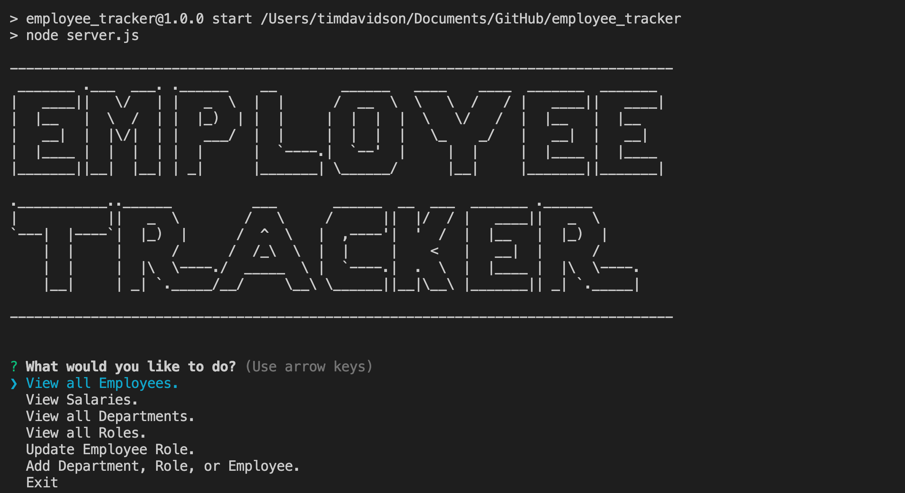

# Employee Manangement
## Description
This app is used to manage employee records. The user may add, delete or update the employee, names, salaries, roles and more. 
## Table of Contents
- [Description](#description)
- [Installation](#installation)
- [Usage](#usage)
- [License](#license)
- [Contributors](#contributors)
- [Tests](#tests)
- [Questions](#questions)
- [Contact](#contact)
## Installation
All the user needs to do is open integrated terminal and run "npm start" from the command line. 
## Usage

## Mock up

This is a screenshot of the home screen.

Here is a video walkthrough of the app

<a href="https://drive.google.com/file/d/15_q73TNsPbFJdfz43XAfBFyExa19OOSF/view">Video Walthrough</a>

## License

Source link for [MIT](https://opensource.org/licenses/MIT)

## Contributors
Tim Davidson
## Tests
There are no test instructions. 
## Questions
undefined
## Contact
[GitHub Profile](https://github.com/https://github.com/timdavidson2)
[Email Me](timdavidson2@gmail.com)
